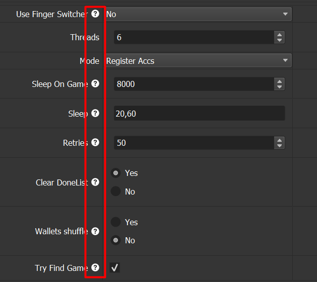
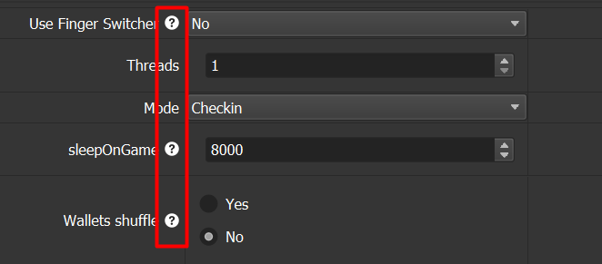

# BASEMENT PLAYER

Written by: @hvrsh (TG)

Channel: https://t.me/hashvers

---
**Automation of Interactions with BASEMENT**

**Configuration upon launching `basement_regMM.xml`:**

Register accs, and tried to mint all games 

All descriptions is right on the script

**Configuration upon launching `basement_checkinMM.xml`:**

Daily checkin on accs from `privates.txt`

All descriptions is right on the script

**Files for Work**

`private.txt` - privates and refcode. Example: (private,refcode)
`proxy.txt` - proxies in any standard format